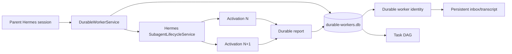

# H1 Hermes Durable Workers

Status: experimental, opt-in, not production enabled.

## Goal

H1 proves a narrow architectural claim: a Hermes worker identity can outlive a
specific `AIAgent` activation. The worker keeps a durable inbox, transcript,
activation ledger, parent ownership, and a small dependency graph in SQLite.
Every execution is still performed by Hermes' existing public subagent lifecycle.

No DeepSeek Harness code or runtime dependency is used.

## Architecture



The important invariant is:

`worker_id != activation_id != subagent_id`

The worker is durable. An activation is disposable. A subagent is a runtime
implementation detail of one activation.

## Cold reactivation semantics

H1 supports activation-level cold reactivation:

1. create a durable worker;
2. send a message and complete an activation;
3. terminate/restart the Hermes process;
4. enable the plugin again;
5. send another message to the same `worker_id`;
6. a fresh Hermes subagent receives the prior durable transcript as bounded context.

H1 does **not** attempt to serialize a live `AIAgent` or resume an interrupted
model/tool call mid-activation. If a process disappears while an activation is
running, the next plugin startup marks that activation `ABANDONED`, returns its
`PROCESSING` inbox item to `PENDING`, and makes the worker `DORMANT` again.

## Safety

Worker operations are scoped to the active parent session. Looking up another
parent's `worker_id` fails closed. H1 does not persist credentials, sockets,
callbacks, LLM clients, threads, or Python agent objects.

The actual execution path uses Hermes' existing subagent lifecycle, preserving
its tool restrictions, approvals, iteration budget, cancellation, and host
aggregation behavior.

## Task DAG

H1 includes only the minimum orchestration primitive required for evaluation:

* statuses: `pending`, `in_progress`, `completed`, `failed`, `cancelled`;
* optional worker owner;
* `blocked_by` dependencies;
* readiness derived from blocker completion;
* cycle rejection;
* integer revision and compare-and-set updates.

This is intentionally not a general workflow engine.

## Enable for an isolated test

After installing a build containing this branch, explicitly opt in:

```bash
hermes plugins enable durable-workers
```

Restart only the isolated test Hermes process, not a production gateway.

Inside a Hermes conversation, the plugin exposes the `durable_worker` tool and
an operator slash command:

```text
/workers
/workers show <worker_id>
/workers send <worker_id> <follow-up>
/workers tasks
```

The model-facing tool supports `create`, `enqueue`, `send`, `run_next`,
`reports`, and the task DAG actions.

## H1 acceptance boundary

H1 is successful when tests prove:

* stable worker identity across store/service reconstruction;
* distinct activations for follow-ups;
* prior transcript reaches the next activation;
* parent ownership rejects cross-session access;
* inbox idempotency and persistence;
* activation reports are durable;
* DAG readiness, cycle rejection, and revision CAS work.

A real-machine recipe with a real model remains a separate isolated deployment
step because this GitHub execution environment cannot reach `srv-hermes`.

## H2 direction

If H1 is accepted, H2 should expose these service methods as typed Gateway/API
operations for Hermes-Harness-UI instead of teaching the UI to read SQLite.
The browser should use paginated/query APIs and incremental events; it should
never own Hermes runtime state or load unbounded session histories.
